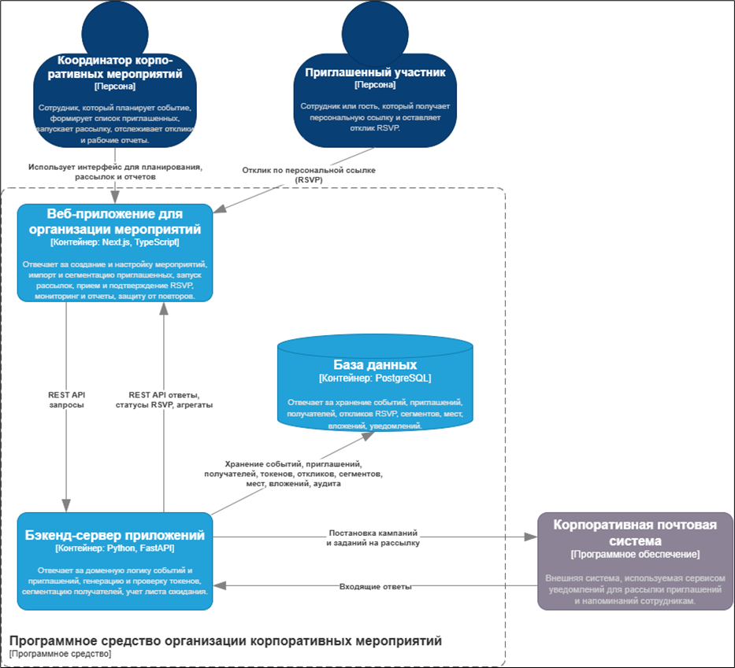
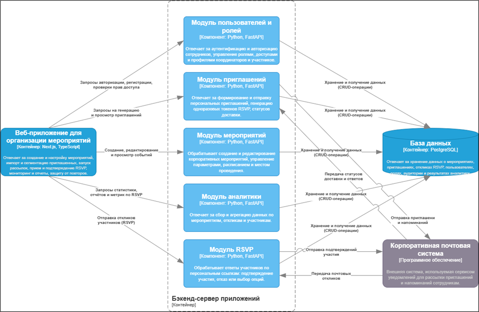
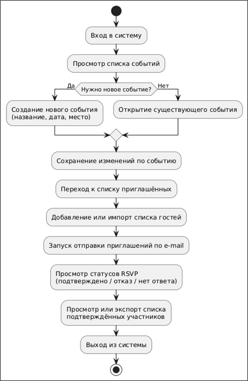
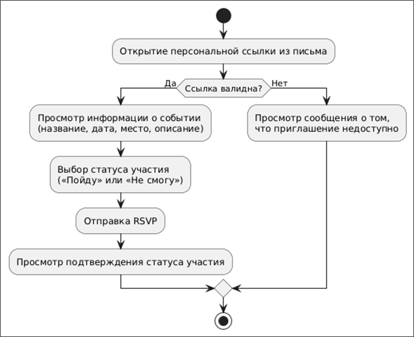
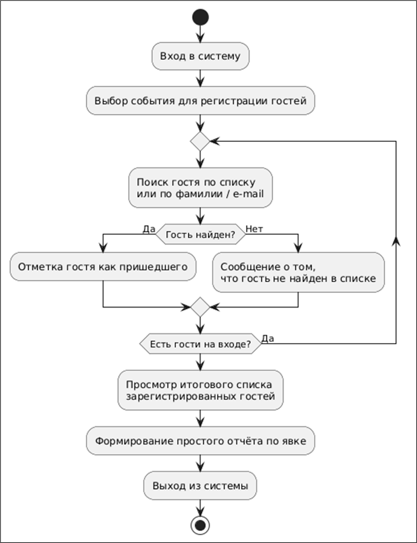
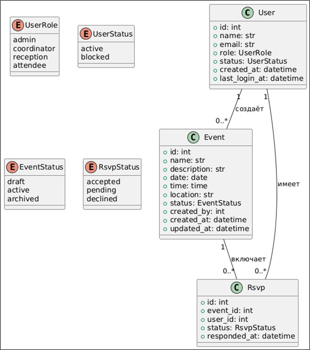
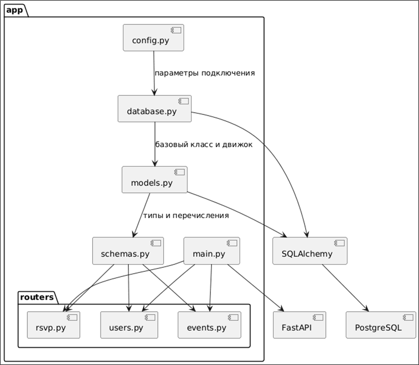
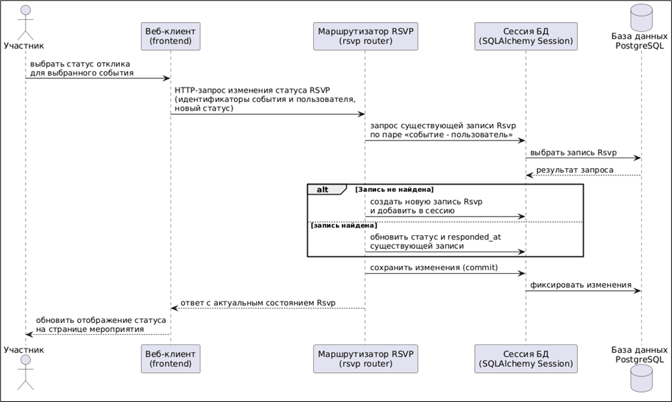

# **Программное средство организации корпоративных мероприятий с использованием функции RSVP**

Краткое описание проекта, его цели и основные возможности

Ссылки на репозитории сервера и клиента

---

## **Содержание**

1. [Архитектура](#Архитектура)
   1. [C4-модель](#C4-модель)
   2. [Схема данных](#Схема_данных)
2. [Функциональные возможности](#Функциональные_возможности)
   1. [Диаграмма вариантов использования](#Диаграмма_вариантов_использования)
   2. [User-flow диаграммы](#User-flow_диаграммы)
3. [Детали реализации](#Детали_реализации)
   1. [UML-диаграммы](#UML-диаграммы)
   2. [Спецификация API](#Спецификация_API)
   3. [Безопасность](#Безопасность)
   4. [Оценка качества кода](#Оценка_качества_кода)
4. [Тестирование](#Тестирование)
   1. [Unit-тесты](#Unit-тесты)
   2. [Интеграционные тесты](#Интеграционные_тесты)
5. [Установка и запуск](#installation)
   1. [Манифесты для сборки docker образов](#Манифесты_для_сборки_docker_образов)
   2. [Манифесты для развертывания k8s кластера](#Манифесты_для_развертывания_k8s_кластера)
6. [Лицензия](#Лицензия)
7. [Контакты](#Контакты)

---

## **Архитектура**

### C4-модель

Иллюстрация и описание архитектура ПС


Контейнерный уровень в нотации C4


Компонентный уровень в нотации C4

### Схема данных

Описание отношений и структур данных, используемых в ПС. Также представить скрипт (программный код), который необходим для генерации БД


Физическая модель базы данных

---

## **Функциональные возможности**

### Диаграмма вариантов использования

Диаграмма вариантов использования и ее описание

### User-flow диаграммы


User-flow для координатора корпоративных мероприятий


User-flow для приглашённого участника


User-flow для сотрудника ресепшена

---

## **Детали реализации**

### UML-диаграммы


UML–диаграмма классов доменной модели сервиса RSVP


UML–диаграмма компонентов серверной части


UML–диаграмма последовательности изменения статуса отклика

### Спецификация API

FastAPI автоматически формирует спецификацию **OpenAPI 3.0**, на основе которой отображается интерактивная документация Swagger UI и формируется файл для импорта в Postman.

- Базовый URL сервера при локальном запуске: `http://localhost:8000`.
- Документация Swagger UI доступна по адресу: `http://localhost:8000/docs`.
- Машиночитаемая спецификация OpenAPI доступна по адресу: `http://localhost:8000/openapi.json`.

Для использования API в Postman спецификация сохранена в репозитории в виде отдельного файла:

- `docs/openapi_planora.json` – файл, экспортированный из `http://localhost:8000/openapi.json`.

Файл можно импортировать в Postman как коллекцию запросов, что позволяет быстро запускать тестовые сценарии, проверять корректность запросов и просматривать структуру входных и выходных данных.

### Безопасность

Система Planora использует многоуровневый подход к безопасности: безопасное хранение паролей, аутентификацию на основе OAuth2 и JWT, ролевую авторизацию и защиту API на уровне FastAPI.

#### Аутентификация и хранение паролей

Пароли пользователей никогда не хранятся в открытом виде. На сервере используется библиотека `passlib` с алгоритмом `bcrypt`: при регистрации пароль хэшируется, при входе сравнивается введённое значение с хэшем.

```python
from passlib.context import CryptContext

pwd_context = CryptContext(schemes=["bcrypt"], deprecated="auto")

def verify_password(plain_password: str, hashed_password: str) -> bool:
    return pwd_context.verify(plain_password, hashed_password)

def get_password_hash(password: str) -> str:
    return pwd_context.hash(password)
```

При создании пользователя в базу записывается только хэш пароля:

```python
from .security.passwords import get_password_hash
from .models.users import User
from .schemas.users import UserCreate

def create_user(db, user_in: UserCreate) -> User:
    db_user = User(
        email=user_in.email,
        full_name=user_in.full_name,
        hashed_password=get_password_hash(user_in.password),
        role=user_in.role,
    )
    db.add(db_user)
    db.commit()
    db.refresh(db_user)
    return db_user
```

#### JWT–токены и вход в систему

Аутентификация построена на схеме OAuth2 с выдачей access–токена в формате JWT. Токен содержит идентификатор пользователя и его роль и имеет ограниченный срок жизни.

```python
from datetime import datetime, timedelta
from jose import jwt
from pydantic import BaseModel

SECRET_KEY = "change-me"
ALGORITHM = "HS256"
ACCESS_TOKEN_EXPIRE_MINUTES = 30

class TokenData(BaseModel):
    user_id: str | None = None
    role: str | None = None

def create_access_token(data: dict, expires_delta: timedelta | None = None) -> str:
    to_encode = data.copy()
    expire = datetime.utcnow() + (expires_delta or timedelta(minutes=ACCESS_TOKEN_EXPIRE_MINUTES))
    to_encode.update({"exp": expire})
    return jwt.encode(to_encode, SECRET_KEY, algorithm=ALGORITHM)
```

Эндпоинт `/auth/token` принимает логин и пароль, проверяет учётные данные и возвращает JWT–токен:

```python
from fastapi import APIRouter, Depends, HTTPException, status
from fastapi.security import OAuth2PasswordRequestForm
from .security.tokens import create_access_token
from .security.passwords import verify_password
from .models.users import User
from .dependencies import get_db

router = APIRouter(prefix="/auth", tags=["auth"])

@router.post("/token")
def login(form_data: OAuth2PasswordRequestForm = Depends(), db=Depends(get_db)):
    user: User | None = db.query(User).filter(User.email == form_data.username).first()
    if user is None or not verify_password(form_data.password, user.hashed_password):
        raise HTTPException(
            status_code=status.HTTP_401_UNAUTHORIZED,
            detail="Неверный логин или пароль",
        )
    if not user.is_active:
        raise HTTPException(
            status_code=status.HTTP_403_FORBIDDEN,
            detail="Учётная запись заблокирована",
        )
    access_token = create_access_token({"sub": user.id, "role": user.role})
    return {"access_token": access_token, "token_type": "bearer"}
```

#### Ролевая авторизация и защита эндпоинтов

Поверх аутентификации реализовано разграничение доступа по ролям: `admin`, `coordinator`, `attendee`, `reception`. Для этого используется зависимость `get_current_user` и обёртка `require_role`.

```python
from fastapi import Depends, HTTPException, status
from fastapi.security import OAuth2PasswordBearer
from .tokens import decode_token
from .models.users import User
from .dependencies import get_db

oauth2_scheme = OAuth2PasswordBearer(tokenUrl="/auth/token")

async def get_current_user(token: str = Depends(oauth2_scheme), db=Depends(get_db)) -> User:
    token_data = decode_token(token)
    if token_data.user_id is None:
        raise HTTPException(
            status_code=status.HTTP_401_UNAUTHORIZED,
            detail="Не удалось проверить токен",
        )
    user = db.query(User).get(token_data.user_id)
    if user is None or not user.is_active:
        raise HTTPException(
            status_code=status.HTTP_401_UNAUTHORIZED,
            detail="Пользователь не найден или заблокирован",
        )
    return user
```

```python
from fastapi import Depends, HTTPException, status
from .deps import get_current_user
from .models.users import User

def require_role(allowed_roles: list[str]):
    def role_checker(current_user: User = Depends(get_current_user)) -> User:
        if current_user.role not in allowed_roles:
            raise HTTPException(
                status_code=status.HTTP_403_FORBIDDEN,
                detail="Недостаточно прав для выполнения операции",
            )
        return current_user
    return role_checker
```

Пример защиты доменных эндпоинтов:

```python
from fastapi import APIRouter, Depends
from .security.roles import require_role
from .models.users import User

router = APIRouter(prefix="/events", tags=["events"])

@router.get("/", dependencies=[Depends(require_role(["coordinator", "admin"]))])
def list_events(current_user: User = Depends(require_role(["coordinator", "admin"]))):
    ...

@router.post("/{event_id}/checkin", dependencies=[Depends(require_role(["coordinator", "reception"]))])
def checkin_guest(event_id: str, current_user: User = Depends(require_role(["coordinator", "reception"]))):
    ...
```

### Оценка качества кода

Оценка качества кода серверной части выполнена с использованием инструментов `radon` и `pylint`.

Команды запуска:

```bash
radon cc -s -a app      # цикломатическая сложность
radon mi -s app         # индекс сопровождаемости
pylint app              # статический анализ
```

Сводные результаты расчёта метрик представлены в таблице.

| №   | Метрика                         | Инструмент | Команда              | Результат для проекта                                                                   | Комментарий                                                                              |
| --- | ------------------------------- | ---------- | -------------------- | --------------------------------------------------------------------------------------- | ---------------------------------------------------------------------------------------- |
| 1   | Цикломатическая сложность       | radon      | `radon cc -s -a app` | Средняя сложность: **A (1.47)**; максимальное значение для отдельных функций: **A (4)** | Вся бизнес–логика реализована простыми ветвлениями, функции легко читать и сопровождать. |
| 2   | Индекс сопровождаемости (MI)    | radon      | `radon mi -s app`    | Диапазон MI по модулям: от **44.46** до **100.00**                                      | Наибольшее снижение MI наблюдается у маршрутизаторов, содержащих прикладную логику.      |
| 3   | Статический анализ и стиль кода | pylint     | `pylint app`         | Интегральный рейтинг: **7.56 / 10**                                                     | Основные замечания касаются docstring, стиля имен и небольшого дублирования кода.        |

По результатам анализа можно сделать вывод, что структура кода остаётся простой, а подавляющее большинство модулей имеют высокий индекс сопровождаемости. Имеющиеся замечания носят в основном косметический характер и могут быть устранены в процессе дальнейшего рефакторинга.

---

## **Тестирование**

Разработка unit- и интеграционных тестов выполнена в рамках лабораторной работы №5. Для тестирования используется библиотека **Pytest**, плагин **pytest–cov** и тестовый клиент FastAPI `TestClient`.

Запуск полного набора тестов с измерением покрытия кода выполняется командой:

```bash
python -m pytest --cov=app --cov-report=term-missing
```

По итогам прогона тестов суммарное покрытие пакета `app` составляет **96 %**. Основные модули (модели, схемы и маршрутизаторы пользователей, событий и RSVP) имеют покрытие не ниже 93–100 %, непокрытыми остаются только вспомогательные участки кода и редкие ветви обработки ошибок.

### Unit–тесты

Unit–тесты сгруппированы по доменным сущностям и размещены в каталоге `__tests__`:

- `test_users_api.py` – проверки операций создания, получения, обновления и удаления пользователей;
- `test_events_api.py` – проверки операций над событиями и базовой статистики по RSVP;
- `test_rsvp_api.py` – проверки сценариев установки и чтения RSVP–откликов.

Тестовая среда настраивается в файле `__tests__/conftest.py`:

- создаётся отдельная база данных SQLite и тестовый SQLAlchemy–двигатель;
- выполняется пересоздание таблиц по `Base.metadata` для тестовой БД;
- стандартная зависимость `get_db` переопределяется функцией `override_get_db`, возвращающей тестовую сессию;
- через `TestClient` выполняются HTTP–запросы к приложению без запуска реального сервера.

Пример unit–теста для создания и получения пользователя:

```python
from http import HTTPStatus
from starlette.testclient import TestClient

def test_create_and_get_user(client: TestClient) -> None:
    payload = {
        "name": "Test User",
        "email": "user@example.com",
        "role": "attendee",
        "status": "active",
    }

    response_create = client.post("/api/admin/users", json=payload)
    assert response_create.status_code in (HTTPStatus.OK, HTTPStatus.CREATED)

    created = response_create.json()
    user_id = created["id"]

    assert created["name"] == payload["name"]
    assert created["email"] == payload["email"]
    assert created["role"] == payload["role"]
    assert created["status"] == payload["status"]

    response_get = client.get(f"/api/admin/users/{user_id}")
    assert response_get.status_code == HTTPStatus.OK

    data = response_get.json()
    assert data["id"] == user_id
    assert data["email"] == payload["email"]
```

### Интеграционные тесты

Интеграционные тесты проверяют совместную работу нескольких подсистем – пользователей, событий и RSVP–откликов, а также корректность расчёта агрегированной статистики.

Пример интеграционного теста для проверки статистики RSVP по событию:

```python
from http import HTTPStatus
from starlette.testclient import TestClient

def create_user(client: TestClient, name: str, email: str) -> int:
    resp = client.post(
        "/api/admin/users",
        json={
            "name": name,
            "email": email,
            "role": "attendee",
            "status": "active",
        },
    )
    assert resp.status_code in (HTTPStatus.OK, HTTPStatus.CREATED)
    return resp.json()["id"]

def test_rsvp_stats_in_events_list(client: TestClient) -> None:
    user1 = create_user(client, "User 1", "u1@example.com")
    user2 = create_user(client, "User 2", "u2@example.com")
    user3 = create_user(client, "User 3", "u3@example.com")

    event_payload = {
        "name": "Test Event",
        "description": "Integration test event",
        "date": "2025-12-31",
        "time": "18:00:00",
        "location": "Office",
        "status": "active",
        "created_by": user1,
    }
    event_resp = client.post("/api/events", json=event_payload)
    assert event_resp.status_code in (HTTPStatus.OK, HTTPStatus.CREATED)
    event_id = event_resp.json()["id"]

    client.post(f"/api/events/{event_id}/rsvp", json={"user_id": user1, "status": "accepted"})
    client.post(f"/api/events/{event_id}/rsvp", json={"user_id": user2, "status": "pending"})
    client.post(f"/api/events/{event_id}/rsvp", json={"user_id": user3, "status": "declined"})

    list_resp = client.get("/api/events")
    assert list_resp.status_code == HTTPStatus.OK

    events = list_resp.json()
    current = next(e for e in events if e["id"] == event_id)

    assert current["rsvpAccepted"] == 1
    assert current["rsvpPending"] == 1
    assert current["rsvpDeclined"] == 1
```

---

## **Установка и запуск**

### Манифесты для сборки docker образов

Для развертывания Planora используется Docker и Docker Compose.

Ниже приведён основной `docker-compose.yml`, который поднимает PostgreSQL, backend и frontend:

```yaml
version: '3.9'

services:
  db:
    image: postgres:16-alpine
    container_name: planora_db
    environment:
      POSTGRES_DB: planora
      POSTGRES_USER: planora_user
      POSTGRES_PASSWORD: ${POSTGRES_PASSWORD}
    volumes:
      - db_data:/var/lib/postgresql/data
    ports:
      - '5432:5432'
    networks:
      - planora_network

  backend:
    build:
      context: ./backend
      dockerfile: Dockerfile
    container_name: planora_backend
    env_file:
      - .env
    environment:
      DATABASE_URL: postgresql+psycopg2://planora_user:${POSTGRES_PASSWORD}@db:5432/planora
      JWT_SECRET_KEY: ${JWT_SECRET_KEY}
      JWT_ALGORITHM: HS256
    depends_on:
      - db
    ports:
      - '8000:8000'
    networks:
      - planora_network

  frontend:
    build:
      context: ./frontend
      dockerfile: Dockerfile
    container_name: planora_frontend
    environment:
      VITE_API_BASE_URL: http://localhost:8000
    ports:
      - '5173:5173'
    networks:
      - planora_network

volumes:
  db_data:

networks:
  planora_network:
    driver: bridge
```

Манифест сборки backend образа:

```dockerfile
FROM python:3.11-slim AS builder

RUN apt-get update && apt-get install -y --no-install-recommends \
    build-essential \
    libpq-dev \
    && rm -rf /var/lib/apt/lists/*

RUN python -m venv /opt/venv
ENV PATH="/opt/venv/bin:$PATH"

COPY backend/requirements.txt .
RUN pip install --no-cache-dir --upgrade pip && \
    pip install --no-cache-dir -r requirements.txt

FROM python:3.11-slim

ENV PATH="/opt/venv/bin:$PATH" \
    PYTHONUNBUFFERED=1

RUN useradd -m -u 1000 planora && mkdir -p /app && chown -R planora:planora /app
USER planora
WORKDIR /app

COPY --from=builder /opt/venv /opt/venv
COPY backend/ /app/

EXPOSE 8000

CMD ["uvicorn", "app.main:app", "--host", "0.0.0.0", "--port", "8000"]
```

Манифест сборки frontend образа:

```dockerfile
FROM node:20-alpine

WORKDIR /app

COPY frontend/package.json frontend/package-lock.json ./
RUN npm ci

COPY frontend/ ./

EXPOSE 5173

CMD ["npm", "run", "dev", "--", "--host", "0.0.0.0", "--port", "5173"]
```

### Манифесты для развертывания k8s кластера

Для развёртывания Planora в Kubernetes можно использовать отдельный набор манифестов.

Ниже приведён пример содержимого этих манифестов.

`k8s/postgres.yml`:

```yaml
apiVersion: v1
kind: Service
metadata:
  name: planora-postgres
spec:
  selector:
    app: planora-postgres
  ports:
    - port: 5432
      targetPort: 5432

---
apiVersion: apps/v1
kind: Deployment
metadata:
  name: planora-postgres
spec:
  replicas: 1
  selector:
    matchLabels:
      app: planora-postgres
  template:
    metadata:
      labels:
        app: planora-postgres
    spec:
      containers:
        - name: postgres
          image: postgres:16-alpine
          env:
            - name: POSTGRES_DB
              value: 'planora'
            - name: POSTGRES_USER
              value: 'planora_user'
            - name: POSTGRES_PASSWORD
              valueFrom:
                secretKeyRef:
                  name: planora-secrets
                  key: POSTGRES_PASSWORD
          ports:
            - containerPort: 5432
```

`k8s/backend.yml`:

```yaml
apiVersion: v1
kind: Service
metadata:
  name: planora-backend
spec:
  selector:
    app: planora-backend
  ports:
    - port: 8000
      targetPort: 8000

---
apiVersion: apps/v1
kind: Deployment
metadata:
  name: planora-backend
spec:
  replicas: 1
  selector:
    matchLabels:
      app: planora-backend
  template:
    metadata:
      labels:
        app: planora-backend
    spec:
      containers:
        - name: backend
          image: planora-backend:latest
          env:
            - name: DATABASE_URL
              valueFrom:
                secretKeyRef:
                  name: planora-secrets
                  key: DATABASE_URL
            - name: JWT_SECRET_KEY
              valueFrom:
                secretKeyRef:
                  name: planora-secrets
                  key: JWT_SECRET_KEY
            - name: JWT_ALGORITHM
              value: 'HS256'
          ports:
            - containerPort: 8000
```

`k8s/frontend.yml`:

```yaml
apiVersion: v1
kind: Service
metadata:
  name: planora-frontend
spec:
  type: LoadBalancer
  selector:
    app: planora-frontend
  ports:
    - port: 80
      targetPort: 5173

---
apiVersion: apps/v1
kind: Deployment
metadata:
  name: planora-frontend
spec:
  replicas: 1
  selector:
    matchLabels:
      app: planora-frontend
  template:
    metadata:
      labels:
        app: planora-frontend
    spec:
      containers:
        - name: frontend
          image: planora-frontend:latest
          env:
            - name: VITE_API_BASE_URL
              value: 'http://planora-backend:8000'
          ports:
            - containerPort: 5173
```

---

## **Лицензия**

Этот проект лицензирован по лицензии MIT - подробности представлены в файле [License.md](License.md)

---

## **Контакты**

Автор: kolya.tsymbal45@gmail.com
